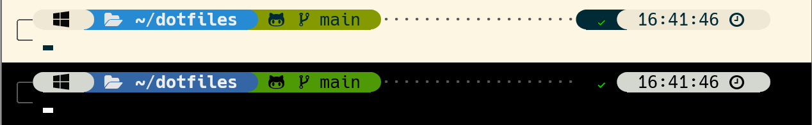
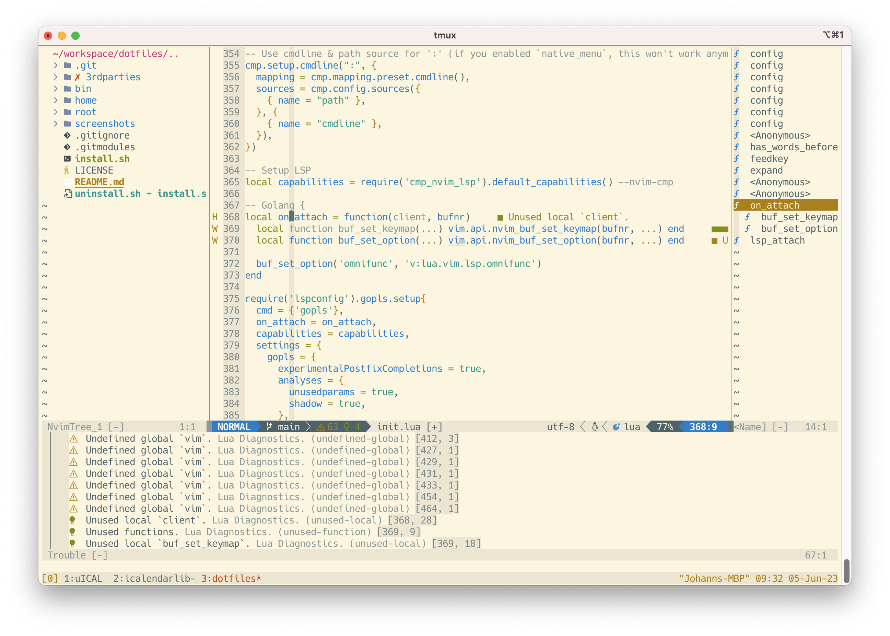
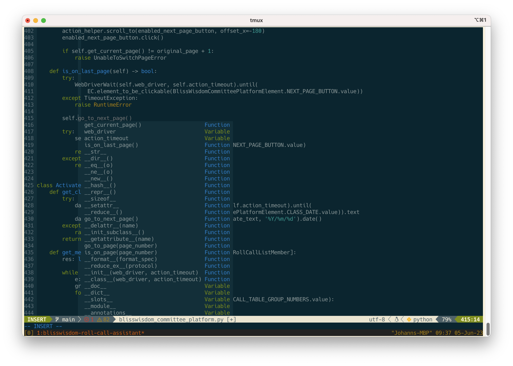
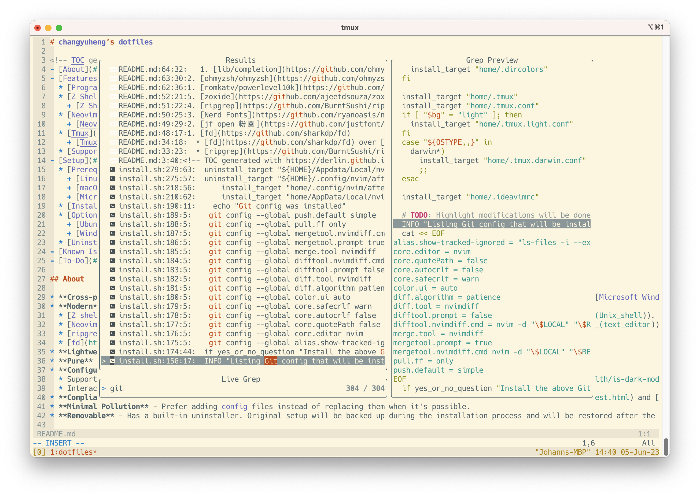
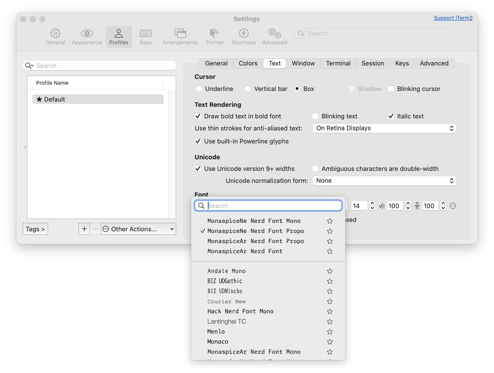

# Johann Chang’s dotfiles

* **Cross-platform** - Support [Linux](https://en.wikipedia.org/wiki/Linux), [macOS](https://en.wikipedia.org/wiki/MacOS), and [Microsoft Windows](https://en.wikipedia.org/wiki/Microsoft_Windows).
* **Modern** - Richer features and better performance:
  * [Fish](https://en.wikipedia.org/wiki/Fish_(Unix_shell)) over [Bourne Again Shell (Bash)](https://en.wikipedia.org/wiki/Bash_(Unix_shell)).
  * [Neovim](https://en.wikipedia.org/wiki/Vim_(text_editor)#Neovim) over [Vi IMproved (Vim)](https://en.wikipedia.org/wiki/Vim_(text_editor)).
  * [ripgrep](https://github.com/BurntSushi/ripgrep) over [grep](https://en.wikipedia.org/wiki/Grep).
  * [fd](https://github.com/sharkdp/fd) over [find](https://en.wikipedia.org/wiki/Find_(Unix)).
* **Lightweight** - Balanced between performance and feature count. Can run smoothly on a Raspberry Pi.
* **Pure** - Only putting symbolic links of config files to the system. No modification to existing system files.
* **Configurable**
  * Support both light and dark background. Further reading: [Is Dark Mode Better for Your Eyes?](https://rxoptical.com/eye-health/is-dark-mode-better-for-your-eyes/)
  * Interactive installation process.
* **Compliant** - Follow standards of [XDG Base Directory](https://specifications.freedesktop.org/basedir-spec/basedir-spec-latest.html) and [Unix](https://en.wikipedia.org/wiki/Unix) convention.
* **Minimal Pollution** - Prefer adding config files instead of replacing them when it's possible.
* **Removable** - Has a built-in uninstaller. Original setup will be backed up during the installation process and will be restored after the uninstallation.

---

<!-- TOC start (generated with https://github.com/derlin/bitdowntoc) -->

- [Features](#features)
   * [Programs and Fonts](#programs-and-fonts)
   * [Fish](#fish)
      + [Fish Plugins](#fish-plugins)
   * [Neovim (nvim)](#neovim-nvim)
      + [Neovim Key Bindings](#neovim-key-bindings)
      + [Neovim Plugins](#neovim-plugins)
   * [Tmux](#tmux)
      + [Tmux Plugins](#tmux-plugins)
   * [Supported Virtual Environments](#supported-virtual-environments)
   * [WezTerm](#wezterm)
- [Setup](#setup)
   * [Prerequisites](#prerequisites)
      + [Linux (tested on Ubuntu 22.04 Jammy Jellyfish and Raspberry Pi OS Bookworm)](#linux-tested-on-ubuntu-2204-jammy-jellyfish-and-raspberry-pi-os-bookworm)
      + [macOS](#macos)
      + [Windows (tested on Windows 10)](#windows-tested-on-windows-11)
   * [Installation](#installation)
   * [Optional Tweak](#optional-tweak)
      + [General](#general)
      + [macOS](#macos-1)
      + [Ubuntu](#ubuntu)

<!-- TOC end -->

## Features

### Programs and Fonts

1. [fd](https://github.com/sharkdp/fd)
2. [Nerd Fonts](https://github.com/ryanoasis/nerd-fonts)
3. [ripgrep](https://github.com/BurntSushi/ripgrep)
4. [zoxide](https://github.com/ajeetdsouza/zoxide)

### Fish



#### Fish Plugins

1. [IlanCosman/tide](https://github.com/IlanCosman/tide)

### Neovim (nvim)





1. The current setup is blazingly fast.
2. Reselect visual block after indent/outdent.
3. Enable moving up and down with j and k in wrapped lines.

#### Neovim Key Bindings

| Key Binding                      | Mode                  | Description                                                       | Plugin                                                             |
| -------------------------------- | --------------------- | ----------------------------------------------------------------- | ------------------------------------------------------------------ |
| `<Leader>` `/`                   | NORMAL                | Clear search highlight                                            | Built-in                                                           |
| `w` `!` `!`                      | NORMAL                | Save file as root                                                 | Built-in                                                           |
| `<Ctrl>` + `j`                   | COMMAND               | Move up to lines that have identical prefixes                     | Built-in                                                           |
| `<Ctrl>` + `k`                   | COMMAND               | Move down to lines that have identical prefixes                   | Built-in                                                           |
| `<Ctrl>` + `a`                   | COMMAND               | Move to the beginning the line                                    | Built-in                                                           |
| `<Ctrl>` + `e`                   | COMMAND               | Move to the end the line                                          | Built-in                                                           |
| `g` `c` `c`                      | NORMAL                | Toggle the current line using linewise comment                    | [Comment.nvim](https://github.com/numToStr/Comment.nvim)           |
| `g` `b` `c`                      | NORMAL                | Toggle the current line using blockwise comment                   | [Comment.nvim](https://github.com/numToStr/Comment.nvim)           |
| `[count]` `g` `c` `c`            | NORMAL                | Toggle the number of line given as a prefix-count using linewise  | [Comment.nvim](https://github.com/numToStr/Comment.nvim)           |
| `[count]` `g` `b` `c`            | NORMAL                | Toggle the number of line given as a prefix-count using blockwise | [Comment.nvim](https://github.com/numToStr/Comment.nvim)           |
| `g` `c` `[count]` `<motion>`     | NORMAL                | (Op-pending) Toggle the region using linewise comment             | [Comment.nvim](https://github.com/numToStr/Comment.nvim)           |
| `g` `b` `[count]` `<motion>`     | NORMAL                | (Op-pending) Toggle the region using blockwise comment            | [Comment.nvim](https://github.com/numToStr/Comment.nvim)           |
| `g` `c` `o`                      | NORMAL                | Insert comment to the next line and enters INSERT mode            | [Comment.nvim](https://github.com/numToStr/Comment.nvim)           |
| `g` `c` `O`                      | NORMAL                | Insert comment to the previous line and enters INSERT mode        | [Comment.nvim](https://github.com/numToStr/Comment.nvim)           |
| `g` `c` `A`                      | NORMAL                | Insert comment to end of the current line and enters INSERT mode  | [Comment.nvim](https://github.com/numToStr/Comment.nvim)           |
| `g` `c`                          | VISUAL                | Toggle the region using linewise comment                          | [Comment.nvim](https://github.com/numToStr/Comment.nvim)           |
| `g` `b`                          | VISUAL                | Toggle the region using blockwise comment                         | [Comment.nvim](https://github.com/numToStr/Comment.nvim)           |
| `q`                              | Neo-tree window       | Close Neo-tree window                                             | [Neo-tree.nvim](https://github.com/nvim-neo-tree/neo-tree.nvim)    |
| `<Leader>` `w` `f`               | NORMAL                | Open neo-tree.nvim window                                         | [Neo-tree.nvim](https://github.com/nvim-neo-tree/neo-tree.nvim)    |
| `?`                              | Neo-tree window       | Show Neo-tree shortcuts                                           | [Neo-tree.nvim](https://github.com/nvim-neo-tree/neo-tree.nvim)    |
| `q`                              | Aerial window         | Close the aerial.nvim window                                      | [aerial.nvim](https://github.com/stevearc/aerial.nvim)             |
| `<Leader>` `w` `s`               | NORMAL                | Open the aerial.nvim window                                       | [aerial.nvim](https://github.com/stevearc/aerial.nvim)             |
| `?`                              | Aerial window         | Show aerial.nvim shortcuts                                        | [aerial.nvim](https://github.com/stevearc/aerial.nvim)             |
| `{`                              | Aerial window         | Go to previous symbol                                             | [aerial.nvim](https://github.com/stevearc/aerial.nvim)             |
| `}`                              | Aerial window         | Go to next symbol                                                 | [aerial.nvim](https://github.com/stevearc/aerial.nvim)             |
| `<Leader>` `r` `n`               | NORMAL                | Rename LSP symbol                                                 | [inc-rename.nvim](https://github.com/smjonas/inc-rename.nvim)      |
| `<Enter>`                        | VISUAL                | Yank the line you'd like to align and then press `<Enter>`        | [mini.align](https://github.com/echasnovski/mini.align)            |
| `y` `s` `<motion>` `<desired>`   | NORMAL                | Add desired surround around text defined by `<motion>`            | [nvim-surround](https://github.com/kylechui/nvim-surround)         |
| `d` `s` `<existing>`             | NORMAL                | Delete `<existing>` surround                                      | [nvim-surround](https://github.com/kylechui/nvim-surround)         |
| `c` `s` `<existing>` `<desired>` | NORMAL                | Change `<existing>` surround to `<desired>`                       | [nvim-surround](https://github.com/kylechui/nvim-surround)         |
| `S` `<desired>`                  | VISUAL                | Surround when in visual modes (surrounds full selection)          | [nvim-surround](https://github.com/kylechui/nvim-surround)         |
| `q`                              | Telescope window      | Close the telescope window                                        | [telescope.nvim](https://github.com/nvim-telescope/telescope.nvim) |
| `d` `d`                          | Telescope window      | Delete the highlighted buffer                                     | [telescope.nvim](https://github.com/nvim-telescope/telescope.nvim) |
| `<Leader>` `f` `f`               | NORMAL                | Find files                                                        | [telescope.nvim](https://github.com/nvim-telescope/telescope.nvim) |
| `<Leader>` `f` `h`               | NORMAL                | Find files including hidden ones                                  | [telescope.nvim](https://github.com/nvim-telescope/telescope.nvim) |
| `<Leader>` `f` `g`               | NORMAL                | Grep in files                                                     | [telescope.nvim](https://github.com/nvim-telescope/telescope.nvim) |
| `<Leader>` `f` `w`               | NORMAL                | Grep current word in files                                        | [telescope.nvim](https://github.com/nvim-telescope/telescope.nvim) |
| `<Leader>` `f` `b`               | NORMAL                | Find buffers                                                      | [telescope.nvim](https://github.com/nvim-telescope/telescope.nvim) |
| `<Leader>` `f` `u`               | NORMAL                | Show undo tree                                                    | [telescope.nvim](https://github.com/nvim-telescope/telescope.nvim) |
| `<Leader>` `f` `r`               | NORMAL                | Show recent files                                                 | [telescope.nvim](https://github.com/nvim-telescope/telescope.nvim) |
| `<Leader>` `g` `d`               | NORMAL                | Show LSP definitions                                              | [telescope.nvim](https://github.com/nvim-telescope/telescope.nvim) |
| `<Leader>` `g` `r`               | NORMAL                | Show LSP references                                               | [telescope.nvim](https://github.com/nvim-telescope/telescope.nvim) |
| `<Leader>` `g` `i`               | NORMAL                | Show LSP implementations                                          | [telescope.nvim](https://github.com/nvim-telescope/telescope.nvim) |
| `<Leader>` `g` `y`               | NORMAL                | Show LSP type definitions                                         | [telescope.nvim](https://github.com/nvim-telescope/telescope.nvim) |
| `<Leader>` `x` `x`               | NORMAL                | Toogle trouble pain                                               | [trouble.nvim](https://github.com/folke/trouble.nvim)              |
| `<Leader>` `g` `R`               | NORMAL                | Toogle LSP trouble pain                                           | [trouble.nvim](https://github.com/folke/trouble.nvim)              |
| `<Leader>` <code>&#124;</code>   | NORMAL                | Toggle indent helper                                              | [indent-blankline.nvim](indent-blankline.nvim)                     |
| `<Leader>` `s` `b`               | NORMAL                | git blame                                                         | [gitsigns.nvim](https://github.com/lewis6991/gitsigns.nvim)        |

#### Neovim Plugins

1. [aerial.nvim](https://github.com/stevearc/aerial.nvim)
2. [Comment.nvim](https://github.com/numToStr/Comment.nvim)
3. [conform.nvim](https://github.com/stevearc/conform.nvim)
4. [copilot.lua](https://github.com/zbirenbaum/copilot.lua)
5. [CopilotChat.nvim](https://github.com/CopilotC-Nvim/CopilotChat.nvim)
6. [gitsigns.nvim](https://github.com/lewis6991/gitsigns.nvim)
7. [inc-rename.nvim](https://github.com/smjonas/inc-rename.nvim)
8. [indent-blankline.nvim](https://github.com/lukas-reineke/indent-blankline.nvim)
9. [lazy.nvim](https://github.com/folke/lazy.nvim)
10. [lualine.nvim](https://github.com/nvim-lualine/lualine.nvim)
11. [mason.nvim](https://github.com/williamboman/mason.nvim)
12. [mini.align](https://github.com/echasnovski/mini.align)
13. [neo-tree.nvim](https://github.com/nvim-neo-tree/neo-tree.nvim)
14. [NeoSolarized](https://github.com/Tsuzat/NeoSolarized.nvim)
15. [nvim-cmp](https://github.com/hrsh7th/nvim-cmp/)
16. [nvim-config-local](https://github.com/mrjohannchang/nvim-config-local)
17. [nvim-surround](https://github.com/kylechui/nvim-surround)
18. [telescope.nvim](https://github.com/nvim-telescope/telescope.nvim)
19. [trouble.nvim](https://github.com/folke/trouble.nvim)

### Tmux

1. Tmux prefix key: `<Ctrl>` + `s`.
2. Switch to the last window: `<Ctrl>` + `s`.
3. Send prefix: `<Ctrl>` + `a`.
4. Selection:
    1. Select: `v`
    2. Block select: `V`
5. Go through installed plugins for more features.

#### Tmux Plugins

1. [tmux-colors-solarized](https://github.com/seebi/tmux-colors-solarized)
2. [tmux-open](https://github.com/tmux-plugins/tmux-open)
3. [tmux-pain-control](https://github.com/tmux-plugins/tmux-pain-control)
4. [tmux-sidebar](https://github.com/tmux-plugins/tmux-sidebar)
5. [tmux-yank](https://github.com/tmux-plugins/tmux-yank)
6. [Tmux Plugin Manager (tpm)](https://github.com/tmux-plugins/tpm)

### Supported Virtual Environments

1. [Node Version Manager - NVM](https://github.com/nvm-sh/nvm)
2. [Simple Python version management: pyenv](https://github.com/pyenv/pyenv)
3. [Ruby enVironment Manager (RVM)](https://github.com/rvm/rvm)

### WezTerm

WezTerm uses the same leader key as tmux by my design, to provide a consistent user experience between the two. However, this makes it inconvenient to send tmux's prefix key while inside WezTerm. When tmux is required, please use an alternative terminal such as GNOME Terminal, iTerm2, or Windows Terminal. This is why these terminals are installed and configured alongside WezTerm.

## Setup

### Prerequisites

#### Linux (tested on Ubuntu 22.04 Jammy Jellyfish and Raspberry Pi OS Bookworm)

1. Install necessary packages.

    ```
    sudo apt install build-essential cmake git git-lfs golang tmux fontconfig python3 python3-dev python3-venv curl fd-find ripgrep fish exuberant-ctags trash-cli fzf xsel zoxide yapf3 clangd
    ```

2. Change default shell to [fish](https://fishshell.com) via `chsh`.

    Execute `chsh` then input `/usr/bin/fish`.

3. Launch fish. Config fish's theme if you'd like:

    ```
    fish_config
    ```

4. Install [fisher](https://github.com/jorgebucaran/fisher) and fish plugins.

    ```
    curl -sL https://raw.githubusercontent.com/jorgebucaran/fisher/main/functions/fisher.fish | source && fisher install jorgebucaran/fisher
    ```

    1. Install [tide](https://github.com/IlanCosman/tide)

        ```
        fisher install IlanCosman/tide@v6
        ```

        Configure it:

        ```
        tide configure --auto --style=Rainbow --prompt_colors='16 colors' --show_time='24-hour format' --rainbow_prompt_separators=Round --powerline_prompt_heads=Round --powerline_prompt_tails=Round --powerline_prompt_style='Two lines, character and frame' --prompt_connection=Dotted --powerline_right_prompt_frame=No --prompt_spacing=Compact --icons='Many icons' --transient=No
        ```

        For non-Nerd-font environment, use this instead:

        ```
        tide configure --auto --style=Rainbow --prompt_colors='16 colors' --show_time='24-hour format' --rainbow_prompt_separators=Round --powerline_prompt_heads=Round --powerline_prompt_tails=Round --powerline_prompt_style='Two lines, character and frame' --prompt_connection=Dotted --powerline_right_prompt_frame=No --prompt_spacing=Compact --icons='Few icons' --transient=No
        ```

    2. Install [nvm.fish](https://github.com/jorgebucaran/nvm.fish)

        ```
        fisher install jorgebucaran/nvm.fish
        ```

5. [Skip on Raspberry Pi OS] Install [flatpak](https://flatpak.org/).

    ```
    sudo apt install flatpak
    flatpak remote-add --if-not-exists flathub https://flathub.org/repo/flathub.flatpakrepo
    ```

6. Install [Neovim](https://neovim.io/).

    For Ubuntu:

    ```
    sudo add-apt-repository ppa:neovim-ppa/unstable
    sudo apt update
    sudo apt install neovim
    ```

    For Raspberry Pi OS:

    ```
    sudo apt install ninja-build gettext cmake unzip curl
    git clone https://github.com/neovim/neovim
    cd neovim
    make CMAKE_EXTRA_FLAGS="-DCMAKE_INSTALL_PREFIX=/usr/local"
    sudo make install
    ```

7. Install [pyenv](https://github.com/pyenv/pyenv).

    ```
    curl -L https://github.com/pyenv/pyenv-installer/raw/master/bin/pyenv-installer | bash
    ```

8. Install [Nerd Fonts](https://www.nerdfonts.com/) patched [GitHub Next Monaspace](https://monaspace.githubnext.com/).

    1. Download and extract [Monaspace.zip](https://github.com/ryanoasis/nerd-fonts/releases/latest/download/Monaspace.zip).

        ```
        cd /tmp
        wget https://github.com/ryanoasis/nerd-fonts/releases/latest/download/Monaspace.zip
        mkdir -p ~/.local/share/fonts
        unzip Monaspace.zip -d ~/.local/share/fonts
        rm Monaspace.zip
        fc-cache -f -v
        cd
        ```

    2. Then configure the terminal to use the installed font **Monaspace**.

9. Install [WezTerm](https://wezterm.org/install/linux.html).

10. Go to [Installation](#installation).

#### macOS

1. Install [Homebrew](http://brew.sh/).

    ```
    /bin/bash -c "$(curl -fsSL https://raw.githubusercontent.com/Homebrew/install/HEAD/install.sh)"
    ```

    Make sure Homebrew is in the `$PATH`:

    ```
    export PATH="/opt/homebrew/bin:$PATH"
    ```

2. Install necessary packages.

    ```
    brew install coreutils bash fish fd ripgrep tmux neovim trash git-lfs cmake ctags go gotags pyenv zoxide yapf llvm
    ```

4. Install [Nerd Fonts](https://www.nerdfonts.com/) patched [GitHub Next Monaspace](https://monaspace.githubnext.com/):

    ```
    brew install --cask font-monaspace-nerd-font
    ```

5. Install [WezTerm](https://wezterm.org/):

    ```
    brew install --cask wezterm
    ```

6. Install [iTerm2](https://iterm2.com/):

    ```
    brew install --cask iterm2
    ```

    Launch iTerm2 and configure iTerm2 to use Monaspace Nerd Font (MonaspiceNe Nerd Font Propo) that's installed in #3.

    

7. Set default shell to fish. Add `/opt/homebrew/bin/fish` to `/etc/shells`, then do:

    ```
    chsh -s /opt/homebrew/bin/fish
    ```

8. Config the theme of fish if you'd like:

    ```
    fish_config
    ```

9. Install [fisher](https://github.com/jorgebucaran/fisher) and fish plugins.

    ```
    curl -sL https://raw.githubusercontent.com/jorgebucaran/fisher/main/functions/fisher.fish | source && fisher install jorgebucaran/fisher
    ```

    1. Install [tide](https://github.com/IlanCosman/tide)

        ```
        fisher install IlanCosman/tide@v6
        tide configure --auto --style=Rainbow --prompt_colors='16 colors' --show_time='24-hour format' --rainbow_prompt_separators=Round --powerline_prompt_heads=Round --powerline_prompt_tails=Round --powerline_prompt_style='Two lines, character and frame' --prompt_connection=Dotted --powerline_right_prompt_frame=No --prompt_spacing=Compact --icons='Many icons' --transient=No
        ```

    2. Install [nvm.fish](https://github.com/jorgebucaran/nvm.fish)

        ```
        fisher install jorgebucaran/nvm.fish
        ```

#### Windows (tested on Windows 11)

1. `$HOME` (`%USERPROFILE%`) folder **has to** be on an [NTFS](https://en.wikipedia.org/wiki/NTFS) volume.

2. Install [Git for Windows](https://gitforwindows.org/)

    **Note:**

    1. **Uncheck** Git LFS (Large File Support)
    2. **Check** Use external OpenSSH
    3. **Check** Enable symbolic links

3. Install [OpenSSH](https://www.openssh.com/) Client if you haven't (should be installed by default). Open an **elevated** (Run as administrator) **PowerShell** session and execute the following command:

    ```
    Get-WindowsCapability -Online | Where-Object Name -like 'OpenSSH.Client*' | Add-WindowsCapability -Online
    ```

4. Install [Nerd Fonts](https://www.nerdfonts.com/) patched [GitHub Next Monaspace](https://monaspace.githubnext.com/): Download and extract [Monaspace.zip](https://github.com/ryanoasis/nerd-fonts/releases/latest/download/Monaspace.zip), move `*.otf` to `%WINDIR%\Fonts`.

5. Install [Python](https://www.python.org/downloads/)

    **Note:** Install Python that's from the official website but not Microsoft Store

    1. Add Python to PATH
    2. Disable path length limit

6. Install necessary packages via [winget](https://learn.microsoft.com/en-us/windows/package-manager/). In a regular Command Prompt or PowerShell session, execute the following commands:

    ```
    winget install --accept-package-agreements --accept-source-agreements --exact --id Microsoft.VCRedist.2015+.x64
    winget install --accept-package-agreements --accept-source-agreements --exact --id GitHub.GitLFS
    winget install --accept-package-agreements --accept-source-agreements --exact --id Neovim.Neovim
    winget install --accept-package-agreements --accept-source-agreements --exact --id sharkdp.fd
    winget install --accept-package-agreements --accept-source-agreements --exact --id BurntSushi.ripgrep.MSVC
    winget install --accept-package-agreements --accept-source-agreements --exact --id UniversalCtags.Ctags
    winget install --accept-package-agreements --accept-source-agreements --exact --id junegunn.fzf
    winget install --accept-package-agreements --accept-source-agreements --exact --id ajeetdsouza.zoxide
    winget install --accept-package-agreements --accept-source-agreements --exact --id MSYS2.MSYS2
    winget install --accept-package-agreements --accept-source-agreements --exact --id Microsoft.VisualStudioCode
    winget install --accept-package-agreements --accept-source-agreements --exact --id Microsoft.VisualStudio.2022.BuildTools
    winget install --accept-package-agreements --accept-source-agreements --exact --id LLVM.LLVM
    winget install --accept-package-agreements --accept-source-agreements --exact --id wez.wezterm
    ```

7. Install [Windows Terminal](https://www.microsoft.com/p/windows-terminal/9n0dx20hk701) if you haven't. It should be installed by default.

8. Enable **long file path support** from: Start > Local Group Policy Editor > Local Computer Policy > Computer Configuration > Administrative Templates > System > Filesystem > Enable Win32 long paths

9. Enable the symbolic link support manually by:

    * Adding the current user to: Start > Local Security Policy > Security Settings > Local Policies > User Rights Assignment > Create symbolic links

    Username can be obtained by calling the below command in CMD:

    ```
    echo %USERNAME%
    ```

    Or simply enable [Developer Mode](https://docs.microsoft.com/en-us/windows/apps/get-started/enable-your-device-for-development) from: Settings > Update & Security > For developers > Developer Mode

10. Configure MSYS2

    1. Enable the symbolic link support in MSYS2 by uncommenting the following line in `C:\msys64\msys2_shell.cmd`

        ```
        rem set MSYS=winsymlinks:nativestrict
        ```

        and the following line in `C:\msys64\mingw64.ini`.

        ```
        #MSYS=winsymlinks:nativestrict
        ```

       Note: You can use VS Code to edit those files.

    2. Make `%TMEP%` mounted at `/tmp` by adding the following contents to `C:\msys64\etc\fstab`.

        ```
        none /tmp usertemp binary,posix=0,noacl 0 0
        ```

    3. Set Windows `%USERPROFILE%` folder (`C:\Users\<user name>`) as the `$HOME` folder by adding the following contents to `C:\msys64\etc\fstab`. Ref: [How to change HOME directory and start directory on MSYS2?](https://stackoverflow.com/a/66946901).

        ```
        ##################################################################
        # Canonicalize the two home directories by mounting the windows  #
        # user home with the same path mapping as unix.                  #
        ##################################################################
        C:/Users /home ntfs binary,posix=0,noacl,user 0 0
        ```

    4. Install necessary and useful packages in `UCRT64 / MSYS2`

        ```
        pacman -Sy man fish tmux
        pacman -Sy mingw-w64-ucrt-x86_64-clang
        ```

11. Configure Windows Terminal.

    1. Change key bindings. Go to Windows Terminal > Settings > Actions:

        1. Change `<Ctrl>` + `v` to `<Ctrl>` + `<Shift>` + `v` on Action **Paste**.

        2. Change `<Ctrl>` + `<Shift>` + `w` to `<Ctrl>` + `<F4>` on Action **Close pane**.

        3. Remove `<Ctrl>` + `<Shift>` + `6` key binding by delete the Action **New tab, profile index: 5**.

    2. Make `<Ctrl>` + `<Tab>` / `<Ctrl>` + `<Shift>` + `<Tab>` switch last / oldest used tab, and `<Ctrl>` + `<PgUp>` / `<Ctrl>` + `<PgDown>` switch previous / next tab in tab strip order.

        1. Settings > Interaction > Tab switcher interface style: separate window, in most recently used order.

        2. In Settings > Actions, add keybindgs `<Ctrl>` + `<Tab>` for **Next tab**, `<Ctrl>` + `<Shift>` + `<Tab>` for **Previous tab**.

        3. In Settings > **Open JSON file**, set `tabSwitcherMode` to `inOrder` for `User.nextTab.0` and `User.prevTab.0`.

            ```
            "actions":
            [
                ...
                {
                    "command":
                    {
                        "action": "nextTab",
                        "tabSwitcherMode": "inOrder"
                    },
                    "id": "User.nextTab.0"
                },
                {
                    "command":
                    {
                        "action": "prevTab",
                        "tabSwitcherMode": "inOrder"
                    },
                    "id": "User.prevTab.0"
                }
                ...
            ],
            ```

    3. Make Windows Terminal support MSYS2's shell by adding the following config to `settings.json`:

        ```
            "profiles": {
                "list":
                [
                    // ...
                    {
                        "bellStyle": "none",
                        "commandline": "C:/msys64/msys2_shell.cmd -defterm -here -no-start -ucrt64 -use-full-path -shell fish",
                        "guid": "{17da3cac-b318-431e-8a3e-7fcdefe6d114}",
                        "icon": "C:/msys64/ucrt64.ico",
                        "name": "UCRT64 / MSYS2",
                        "startingDirectory": "%USERPROFILE%"
                    },
                    // ...
                ]
            }
        ```

    4. Config the terminal to use Monaspace Nerd Font and set your prefered text color scheme in Profiles > UCRT64 / MSYS2.

12. Pre-installation

    1. Open an **elevated** (Run as administrator) **PowerShell** session and execute the following command. So that you can use `fsutil` in the later process. After the execution, you may need to restart your computer.

        ```
        Enable-WindowsOptionalFeature -Online -FeatureName Microsoft-Windows-Subsystem-Linux
        ```

    2. Open an "UCRT64 / MSYS2" tab in Windows Terminal.

    3. Unset empty `$tmp` and `$temp`.

        ```
        set --erase tmp
        set --erase temp
        ```

        **Note:** Empty `$tmp` and `$temp` environment variables are extremely error-prone on Windows. And it's difficult to identify the inroduced errors.


    4. Config fish's theme if you'd like:

        ```
        fish_config
        ```

    5. Install [fisher](https://github.com/jorgebucaran/fisher) and fish plugins.

        ```
        curl -sL https://raw.githubusercontent.com/jorgebucaran/fisher/main/functions/fisher.fish | source && fisher install jorgebucaran/fisher
        ```

        1. Install [tide](https://github.com/IlanCosman/tide)

            ```
            fisher install IlanCosman/tide@v6
            tide configure --auto --style=Rainbow --prompt_colors='16 colors' --show_time='24-hour format' --rainbow_prompt_separators=Round --powerline_prompt_heads=Round --powerline_prompt_tails=Round --powerline_prompt_style='Two lines, character and frame' --prompt_connection=Dotted --powerline_right_prompt_frame=No --prompt_spacing=Compact --icons='Many icons' --transient=No
            ```

       2. Install [nvm.fish](https://github.com/jorgebucaran/nvm.fish)

           ```
           fisher install jorgebucaran/nvm.fish
           ```

    6. Enable symlink support for Git. This is necessary for the installation of this dotfiles.

        ```
        git config --global core.symlinks true
        ```

    7. Text files inside dotfiles need to use `LF` as line endings. Don't let Git convert line endings to `CRLF` on Windows.

        ```
        git config --global core.autocrlf false
        git config --global core.safecrlf warn
        ```

13. Go to [Installation](#installation).

### Installation

1. `git clone` this repo and `cd` into it. You can put the dotfiles repository anywhere under `$HOME`, `~/workspace/dotfiles` here is used as an example.

    ```
    mkdir ~/workspace
    cd ~/workspace
    git clone https://github.com/mrjohannchang/dotfiles.git
    cd dotfiles
    ```

2. [**Windows Only**] Enable case sensitive support for sub-modules from a regular **PowerShell** session

    ```
    cd ~\workspace\dotfiles\3rdparties  # Assuming the dotfiles repository has been cloned into ~\workspace\dotfiles
    (Get-ChildItem -Recurse -Directory).FullName | ForEach-Object {fsutil.exe file setCaseSensitiveInfo $_ enable}
    ```

    Then **go back** to the Fish session.

3. Clone sub-modules.

    ```
    git submodule update --init --recursive
    ```

4. **Install this dotfiles**.

    ```
    ./install.sh
    ```

    Note 1: During the installation, if you don't know what to choose, just press enter using the default option.
    Note 2: You have Nerd Font support if you have followed the prerequisites.

5. Reboot and reopen terminal.

6. Install `node` via `nvm`.

    ```
    nvm install lts
    ```

7. Execute `tmux` (the command is `script -c tmux /dev/null` when using **Windows Terminal**) and press `<Ctrl>` + `s` `I` (uppercase i) to install plugins of tmux. It may take a few minutes. Please expect `tmux` frozen during the installation.

8. Execute `nvim` and install desired LSPs via `:Mason`.

### Optional Tweak

#### General

1. Set custom pre-init settings and plugins in `${XDG_CONFIG_HOME}/nvim/lua/custom-pre-init.lua`. For example:

    ```lua
    vim.opt.mouse = ""

    custom_plugins = {
      {
        "folke/tokyonight.nvim",
        lazy = false,
        priority = 1000,
        opts = {},
      },
    }
    ```

2. Set custom post-init settings in `${XDG_CONFIG_HOME}/nvim/lua/custom-post-init.lua`. For example:

    ```lua
    vim.cmd.colorscheme("tokyonight")

    require("lualine").setup({
      options = { theme  = "material" },
    })
    ```

3. [Using tab instead of arrow key to scroll in code completion - JetBrains](https://intellij-support.jetbrains.com/hc/en-us/community/posts/8008270395538-Using-tab-instead-of-arrow-key-to-scroll-in-code-completion)

4. [Visual Studio Code: Use tab (instead of arrow keys) to select Intellisense Suggestions?](https://stackoverflow.com/questions/48097507/visual-studio-code-use-tab-instead-of-arrow-keys-to-select-intellisense-sugge)

#### macOS

1. `Option` + `Arrow` moving between words in Fish and iTerm2

    1. Go to Preferences, Profile, Keys.
    2. Set your left ⌥ key to act as an escape character.
    3. Locate the current shortcut for ⌥ ← or create a new one, with the following settings:
       Keyboard Shortcut: ⌥←
       Action: Send Escape Sequence
       Esc+: b
    4. repeat for the ⌥→ keyboard shortcut with the following settings:
       Keyboard Shortcut: ⌥→
       Action: Send Escape Sequence
       Esc+: f

2. Allow pasting multiple lines at once in iTerm2:

    iTerm2 > Settings > Profiles > Terminal > Terminal may enable paste bracketing

3. Disable smart quotes and dashes from Settings > Keyboard > Text Input > Input Sources > All Input Sources > Use smart quotes and dashes

4. Configure `Option` + `Space` to switch between input methods from Settings > Keyboard > Keyboard Shortcuts > Input Sources

5. Make the scroll direction settings of mouse and trackpad independent, and use mouse middle button to drag: [Mac Mouse Fix](https://macmousefix.com/).

    ```
    brew install mac-mouse-fix
    ```

6. Useful apps from Sindre Sorhus: [Quality crafted apps](https://sindresorhus.com/apps).

#### Ubuntu

1. Install fcitx to replace iBus:

    1. ```
       sudo apt install fcitx-chewing fcitx-table-boshiamy
       ```
    2. Choose `fcitx` as the keyboard input method system in `gnome-language-selector`.
    3. Remove keyboard layouts if there are more than 1 from Input Source in `gnome-control-center` > Region & Language.
    4. Remove the hotkey for switching input source in `gnome-control-center` > Keyboard Shortcuts > Typing.
    5. Replace the hotkey for Trigger Input Method to `<Super>` + `<Space>` in `fcitx-configtool` > Global Config > Hotkey > Trigger Input Method.

2. Key remapping for REALFORCE for Mac keyboard:

    1. Config udev:

       ```
       sudo cp ubuntu/etc/udev/rules.d/1000-key-remapping-for-realforce-for-mac.rules /etc/udev/rules.d
       sudo udevadm control --reload
       ```

    2. In `Startup Applications Preferences`, add an item that executes "${HOME}/dotfiles/bin/linux/swap-option-and-command-for-realforce-for-mac.sh"

#### Windows

1. OpenSSH server.

    1. Install

        **Windows 11**

        1. Go to *Apps > Optional features* and click on *View features*.
        2. Locate *“OpenSSH server”* feature, select it, click *Next*, and then click *Install*.

        **Windows 10 (version 1803 and newer)**

        1. Go to *Apps > Apps & features > Optional features* and click on *Add a feature*.
        2. Locate *“OpenSSH server”* feature, expand it, and select *Install*.

        **Manual**

        1. Download the latest [OpenSSH for Windows binaries](https://github.com/PowerShell/Win32-OpenSSH/releases) (package `OpenSSH-Win64.zip`)

        2. As the Administrator, extract the package to `C:\Program Files\OpenSSH`

        3. As the Administrator, install `sshd` and `ssh-agent` services:

            ```
            powershell.exe -ExecutionPolicy Bypass -File install-sshd.ps1
            ```

    2. Configuring SSH server

        * Allow incoming connections to SSH server in Windows Firewall:

            - When installed as an optional feature, the firewall rule *“OpenSSH SSH Server (sshd)”* should have been created automatically. If not, proceed to create and enable the rule as follows.

            - Either run the following PowerShell command as the Administrator:

                ```
                New-NetFirewallRule -Name sshd -DisplayName 'OpenSSH SSH Server' -Enabled True -Direction Inbound -Protocol TCP -Action Allow -LocalPort 22 -Program "C:\Windows\System32\OpenSSH\sshd.exe"
                ```

                Replace `C:\Windows\System32\OpenSSH\sshd.exe`
                with the actual path to the `sshd.exe` (`C:\Program Files\OpenSSH\ssh.exe` , had you followed the manual installation instructions above).

            - or go to *Control Panel > System and Security > Windows Defender Firewall*[1](https://winscp.net/eng/docs/guide_windows_openssh_server#fn1) *> Advanced Settings > Inbound Rules* and add a new rule for port 22.

        * Start the service and/or configure automatic start:

            - Go to *Control Panel > System and Security > Administrative Tools* and open *Services*. Locate *OpenSSH SSH Server* service.

            - If you want the server to start automatically when your machine is started: Go to *Action > Properties*. In the Properties dialog, change *Startup type* to *Automatic* and confirm.

            - Start the *OpenSSH SSH Server* service by clicking the *Start the service*.

    3. Setting up SSH public key authentication

        1. Method 1

            Add authorized public keys to `%programdata%/ssh/administrators_authorized_keys`

        2. Method 2

            Follow a generic guide for [Setting up SSH public key authentication](https://winscp.net/eng/docs/guide_public_key) in *nix OpenSSH server, with the following difference:

            - Create the `.ssh` folder (for the `authorized_keys` file) in your Windows account profile folder (typically in `C:\Users\username\.ssh`).

        - For permissions to the `.ssh` folder and the `authorized_keys` file, what matters are Windows ACL permissions, not simple *nix permissions. Set the ACL so that the respective Windows account is the owner of the folder and the file and is the only account that has a write access to them. The account that runs *OpenSSH SSH Server* service (typically `SYSTEM` or `sshd`) needs to have read access to the file.

            - Though, with the default Win32-OpenSSH configuration there is an exception set in `sshd_config` for accounts in `Administrators` group. For these, the server uses a different location for the authorized keys file: `%ALLUSERSPROFILE%\ssh\administrators_authorized_keys` (For example: typically `C:\ProgramData\ssh\administrators_authorized_keys`).

    4. Default SSH Shell

        1. Create a CMD file

            ```
            cat << EOF > /c/msys64/sshd-default-shell.cmd
            C:\msys64\msys2_shell.cmd -defterm -here -no-start -mingw64 -shell fish
            EOF
            ```

        2. Add the following content to Windows Registry > `Computer\HKEY_LOCAL_MACHINE\SOFTWARE\OpenSSH` in the string value `DefaultShell`

            ```
            C:\msys64\sshd-default-shell.cmd
            ```

3. Swap keys caps lock and left control.

    ```
    Windows Registry Editor Version 5.00

    [HKEY_LOCAL_MACHINE\SYSTEM\CurrentControlSet\Control\Keyboard Layout]
    "Scancode Map"=hex:00,00,00,00,00,00,00,00,03,00,00,00,1d,00,3a,00,3a,00,1d,00,00,00,00,00

    ; Refs:
    ; https://superuser.com/a/1381836
    ```

### Uninstallation

```
cd ~/workspace/dotfiles
./uninstall.sh
cd ..
rm -rf dotfiles
```

## Known Issues

1. Windows Terminal 'fontFace' not working for any profile after system reboot. [#3257](https://github.com/microsoft/terminal/issues/3257)
