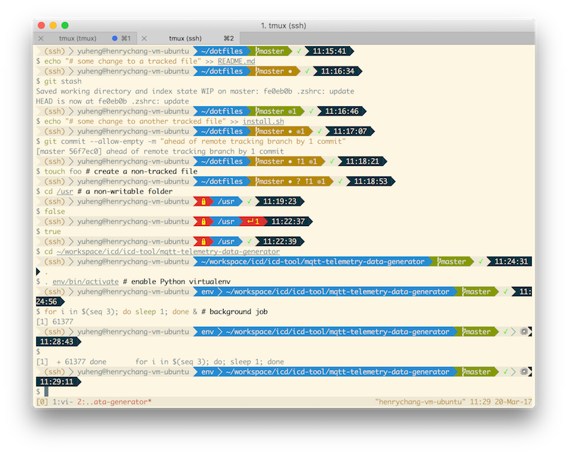
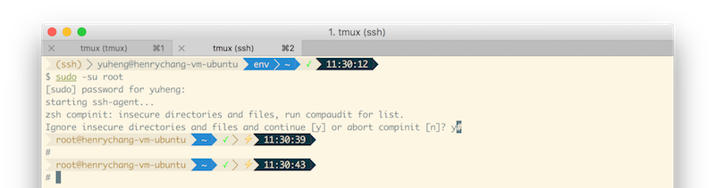
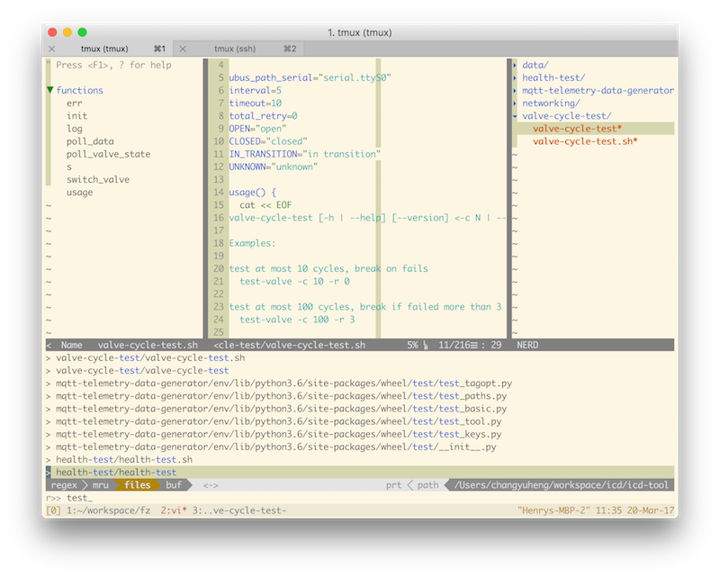
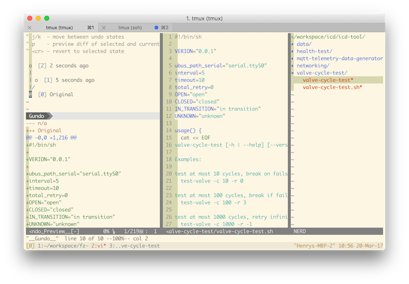
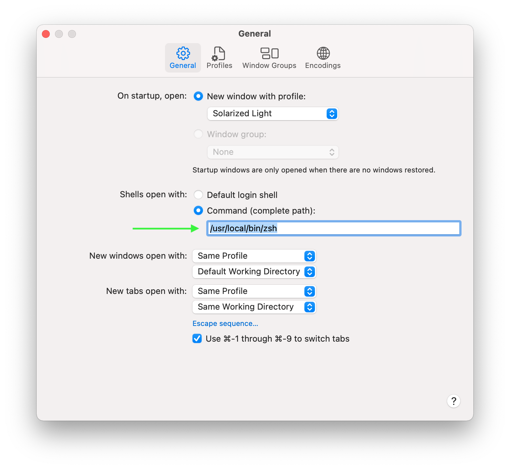
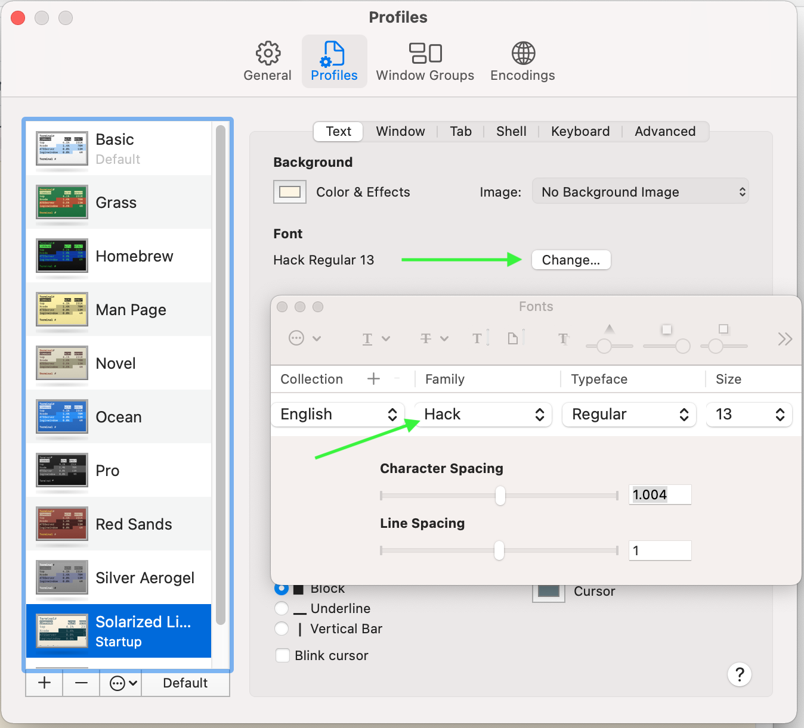

# Dotfiles by changyuheng

## Screenshots






## Prerequisites

### macOS

- [Homebrew](http://brew.sh/)

    ```
    brew install bash zsh cmake ctags go nvm pyenv python3 coreutils fd ripgrep tmux trash fzf vim gotags
    brew tap homebrew/cask-fonts
    brew install font-hack
    ```

- Set the preferred shell to `zsh`.

    

- Set the terminal font to Hack.

    

### Ubuntu (tested on Ubuntu 20.04 Focal Fossa Desktop)

- Install necessary programs.

```
sudo apt install build-essential cmake git golang tmux vim-gtk3 python3 python3-dev curl fd-find ripgrep zsh exuberant-ctags trash-cli fzf fonts-hack-ttf xsel
```

- Set the preferred login shell to `zsh` by `chsh`.

- Install [nvm](https://github.com/creationix/nvm) and [pyenv](https://github.com/pyenv/pyenv) by following their manuals.

- Set the terminal font to Hack.

## Installation

1. `git clone` and `cd` into this repo.

2. Install the configurations:
    ```
    git submodule update --init --recursive --remote
    ./install.sh
    ```

3. Install [zplug](https://github.com/zplug/zplug) with:

    ```
    curl -sL --proto-redir -all,https https://raw.githubusercontent.com/zplug/installer/master/installer.zsh | zsh
    ```

4. Open a new zsh shell to install the plugins of `zplug`.

5. Execute `tmux` and press `C-s I` to install the plugins of it.

6. Execute `vim` and then `:PlugInstall` to install the plugins of it.

## Uninstallation

```
./uninstall.sh
```

## Tweak

### Ubuntu

1. Key remapping for REALFORCE for Mac:

    a. Config udev:
    ```
    sudo cp ubuntu/etc/udev/rules.d/1000-key-remapping-for-realforce-for-mac.rules /etc/udev/rules.d
    sudo udevadm control --reload
    ```
    b. In `Startup Applications Preferences`, add an item that executes "$HOME/dotfiles/scripts/ubuntu/swap-option-and-command-for-realforce-for-mac.sh"

#### Traditional Chinese input methods

1. Install fcitx to replace iBus.

    a.
    ```
    sudo apt install fcitx-chewing fcitx-table-boshiamy
    ```
    b. Choose `fcitx` as the keyboard input method system in `gnome-language-selector`.
    c. Remove keyboard layouts if there are more than 1 from Input Source in `gnome-control-center` > Region & Language.
    d. Remove the hotkey for switching input source in `gnome-control-center` > Keyboard Shortcuts > Typing.
    e. Replace the hotkey for Trigger Input Method to Super + Space in `fcitx-configtool` > Global Config > Hotkey > Trigger Input Method.
