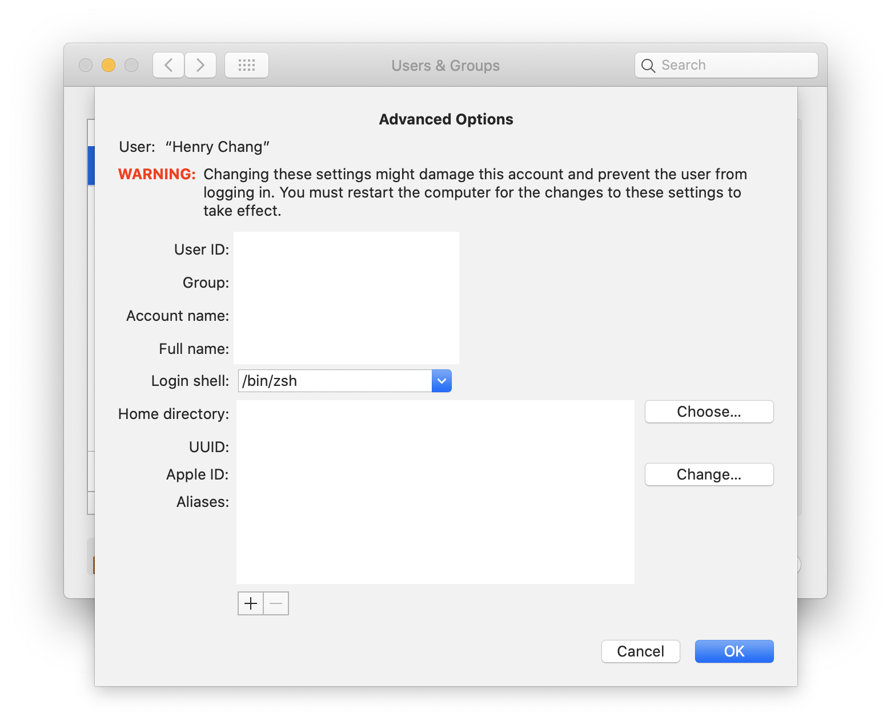

# Dotfiles by changyuheng

## Screenshots


## Prerequisites

- [fzf](https://github.com/junegunn/fzf)
- [nvm](https://github.com/creationix/nvm)
- [pyenv](https://github.com/pyenv/pyenv)
- [zplug](https://github.com/zplug/zplug)

### macOS specific

- [Homebrew](http://brew.sh/)

    ```
    brew install bash
    brew install cmake ctags
    brew install go
    brew install nvm
    brew install pyenv python3
    brew install coreutils fd ripgrep tmux
    ```

- Set preferred login shell

    

### Ubuntu specific

```
sudo apt-get install build-essential cmake python-dev git golang tmux \
  vim-gnome python3 python3-dev curl fd-find ripgrep zsh exuberant-ctags
```

## Installation

1. Clone and cd into this repo.

2. Do this in the terminal:
    ```
    git submodule update --init --recursive --remote
    ./install.sh
    ```

3. Open Tmux and press `C-s I`

4. Open Vim and execute `:PlugInstall`

## Uninstallation

```
./uninstall.sh
```
